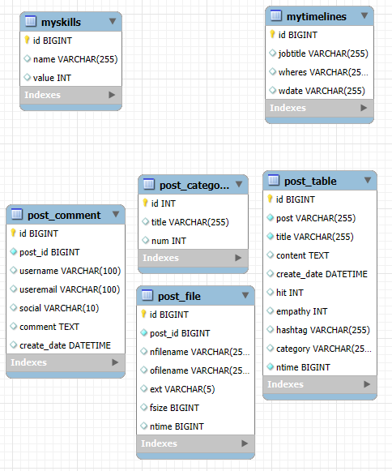
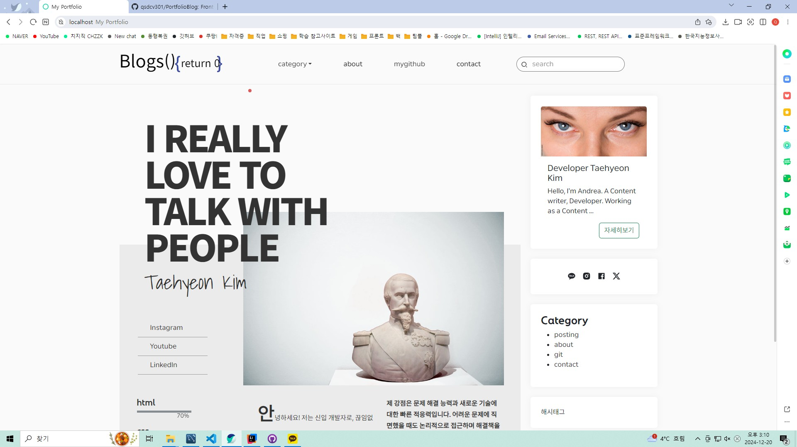
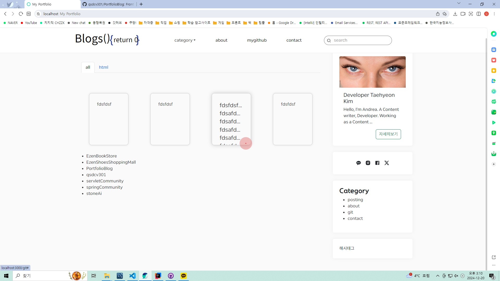
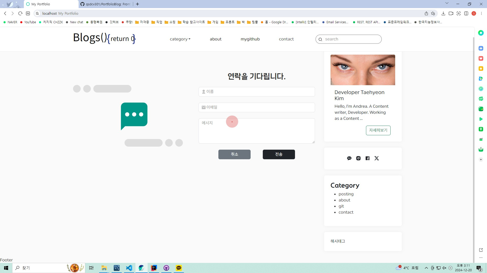

# 📚 웹 애플리케이션 개요

## 1. 🚀 프로젝트 이름

**Portfolio Blog**  

---

## 2. 📖 프로젝트 개요

- **📌 목적**: Front는 React(node.js)로 Back은 Spring Boot(apache)로 REST API 구조 설계 이해와 학습
- **🎯 주요 목표**:
  - ✅ React 활용에 대한 이해와 학습
  - ✅ REST API에 대한 이해와 학습
  - ✅ CORS에 대한 이해와 학습
  - ✅ Oauth 2.0 Login 에 대한 이해와 학습
  - ✅ 블로그 포스팅 관련 기능
  - ✅ 다양한 Portfolio 정보를 제공하는 기능 (github, skill 등)
  - ✅ 제작자에게 이메일을 바로 전송하는 기능

---

## 3. 🔧 기술 스택

### 🛠️ 개발 도구

 

### 🎨 프론트엔드

     

### 🔙 백엔드

### 🗄️ 데이터베이스

### 🤝 협업 도구

### ⚙️ 기타 도구

       

---

## 4. 📜 주요 기능 설명

### 💻 사용자 페이지

- 🔑 **회원가입 및 로그인**
  - SNS 로그인 지원
- 📜 **게시글 작성과 읽기**
  - 본인 블로그에서 글 작성과 다른 사람의 글에 댓글 작성 기능
- 🔍 **검색 기능**
  - 각 블로그에서 다양한 검색을 지원 (제목, 내용, 작성자 등)

---

## 5. 📊 ERD

| ERD | 이미지                            |
| --- | --------------------------------- |
| ERD |  |

---

## 6. 🖼️ 화면 예시

| 화면 설명                         | 이미지                                                                  | 설명                                                                        |
| --------------------------------- | ----------------------------------------------------------------------- | --------------------------------------------------------------------------- |
| 메인 페이지                       |                               | 메인 페이지는 사용자가 사이트에 처음 접속했을 때 표시되는 기본 화면입니다.  |
| 게시글 작성 페이지                  |                   | 글을 작성할 때의 화면에 보여지는 페이지입니다.              |
| 댓글 작성 페이지                |                  | 댓글을 작성할 때의 화면에 보여지는 페이지입니다.          |
| 게시글 내용 페이지                  |                       | 게시글의 내용을 확인할 수 있는 페이지입니다.                                         |
| 블로그 주인 정보 페이지                  |                       | 블로그 주인의 정보를 한눈에 볼 수 있는 페이지입니다.                                         |
| 깃 허브 정보 페이지                   |                           | 블로그 주인의 깃허브에 업로드된 내용을 볼 수 있는 페이지입니다.       |
| 연락하기 페이지                  |                           | 블로그 주인에게 연락할 수 있는 내용 작성 페이지입니다.                    |

---
